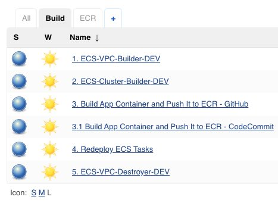

# CloudFormation Templates Repository

This repository contains CloudFormation templates used in various Jenkins jobs that support the deployment of the Greetings micro service for Autotrader.

## Architecture

_Solution Design_

- _!!! Route 53 is only shown here for completeness. It is not part of the implementation because it requires the purchasing and setup of an official domain._
- _!!! The versioning scheme can be implemented with version numbers as show but for simplicity only a tag called 'latest' is used._

## Templates Description

The templates handle two major sets of artifacts: infrastructure and ECS Cluster

### Infrastructure

- VPC
- Subnets
- Network Access Control Lists (NACLs)
- Security Groups (SGs)
- Application Load Balancer (ALB) & its listener, rules, etc.
- ECS Target Group, Service Role, etc.
Refer to the `ecs-vpc-subnets-alb.yml` template for a full list of AWS resources.

### ECS Application Cluster

The following high level CloudFormation (CF) artifacts are create via these templates:

- ECS Cluster
- ECS Service
- ECS Task Definition
- ECR Repository - contains Docker images for regular and Blue/Green deployments
Refer to the `eecs-cluster-without-alb.yml` template for a full list of AWS resources.

## Technology

### AWS

- CloudFormation
- Elastic Container Service (ECS)
- Elastic Container Registry (ECR)
- CLI - installed on AMI; used to execute CF templates from Jenkins and update the ECS service
- Amazon Machine Image (AMI) - for Jenkins instance(s)

### CI/CD

- Jenkins
  - GitHub Integrations Plugin
  - AWS Credentials Plugin
- GitHub
  - Repositories
    - greetings-microservice-repo
    - autotrader-cloudformation-templates
    - Pipelines
- Bash - scripts within Jenkins
- Docker - installed on AMI

## Deployment

### Prerequisites - ECR Repository

_Jenkins Jobs for ECR repository creation and deletion._  

_Create ECR Repo Parameters_  

_Delete ECR Repo Parameters_ - the counterpart job for deleting repositories  

### Deployment Jobs

_All Deployment Jobs_  

_Infrasutrcture Job_  

_ECS Application Cluster Job_  

_ECS Application Cluster Job Parameters_  

_ECS Application Cluster Job Parameters Cont-ed_  

_ECS Application Cluster Job Parameters Cont-ed_  

_ECS Application Cluster Job Parameters Cont-ed_  

_ECS Application Cluster Job Parameters Cont-ed_  

_Build App Container and Push It to ECR_  

_Build App Container and Push It to ECR Parameters_  

_Build App Container and Push It to ECR Parameters Cont-ed_  

_Redeploy ECS Tasks_  

_Redeploy ECS Tasks Parameters_  
